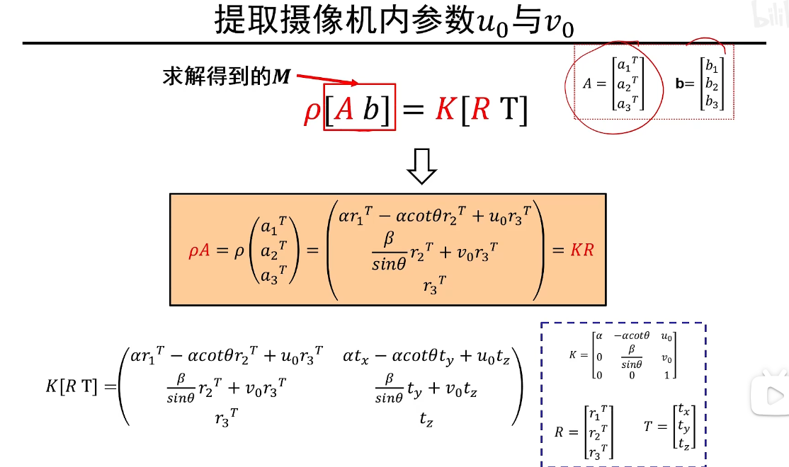
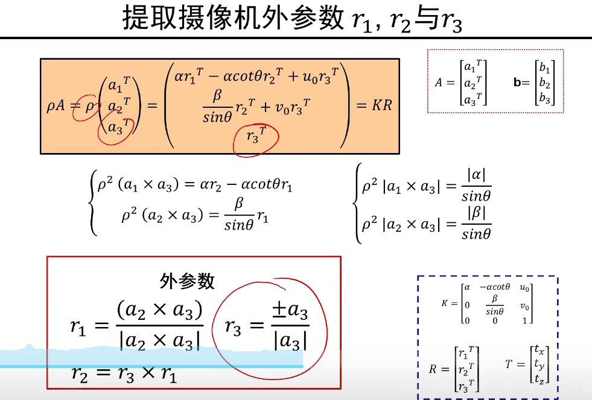

#什么是摄像机标定
摄像机标定就是求解摄像机内、外参数矩阵

P 世界坐标系下的点，p 像素平面上的点

一般规定`r`为列向量，则 `r` 的转置为行向量
旋转矩阵中`r1、r2、r3`互不相关，而且旋转不会放大缩小物体，即`|r1|、|r2|、|r3|均为1`，而且有`ri · rj = 0 i,j∈{1, 2, 3} && i != j`，`r1、r2、r3`互相垂直

其内参数一定是一个满秩矩阵(3×3)

不要 6 个点取在同一个平面上

##径向畸变的摄像机标定

d:理想像素点距离摄像机中心的距离
`λ > 1 : 桶形失真`
`λ < 1 : 枕形失真`

能优化吗？

