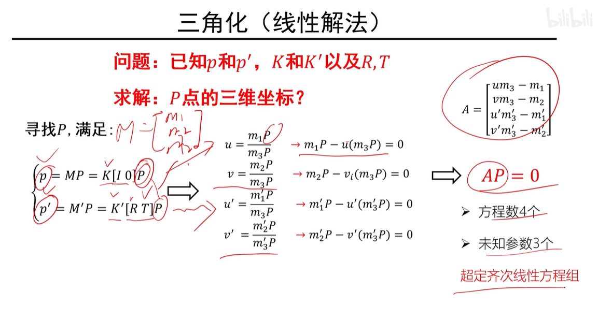
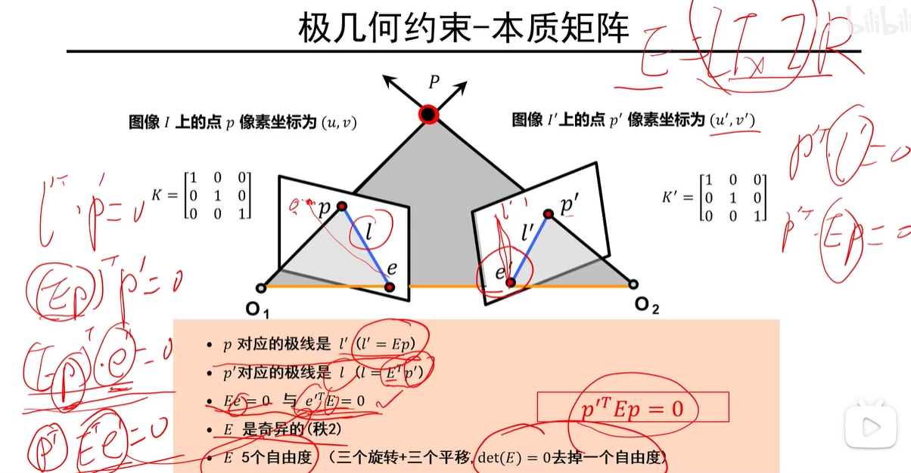
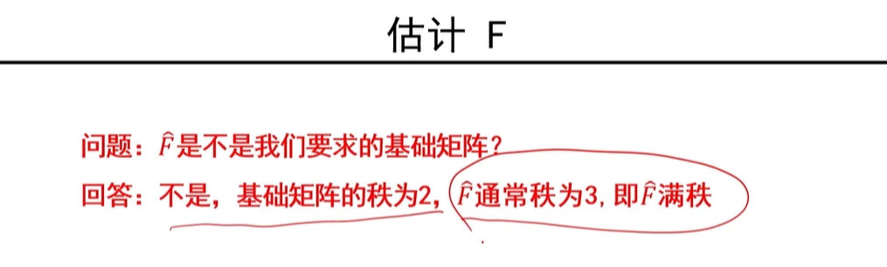

但是通常由于噪声的存在，两条直线通常不能相交

线性解法：

非线性解法：

==求解：牛顿法或者列文伯格——马夸尔特法(L-M 方法)==

##极几何

p 的对应点一定位于极线 l'上，同样的，p'的对应点一定位于极线 l 上

通过极几何约束，将搜索范围限定于对应的极线上

##本质矩阵

旋转矩阵的逆与其转置相等

$O_2 在 O_1 的坐标：(原点对应的坐标，将p'以0代入)-R^TT$

$$
\begin{matrix}
    0&-a_z&a_y\\
    a_z&0&-a_x\\
    -a_y&a_x&0\\
\end{matrix}
$$

此矩阵的秩为 2

p 与 p'，规范化坐标系下的像素坐标

- p 对应极线 $l'(l' = Ep)$
  $p'^TEp = 0$ 而 p'在 $l'$ 直线上，有：$p'^Tl' = 0$，得$l' = Ep$
- $Ee = 0$
  e 在直线 $l$ 上，又 $l = E^Tp'$，有$l^Te = p'^TEe = 0$，因为$p'$可以是直线上任意一点，所以要满足此等式，需要 $Ee = 0$

##基础矩阵

相对于本质矩阵而言，基础矩阵多了摄像机内参数信息

八点法估计`F`

==一个点只能得到一个方程==

**归一化八点法：**

==平移压缩==

**单应矩阵：**

所得点来自同一平面用基础矩阵得不出`F`，出现退化问题

平面 $\pi$ 的方程：$\vec{n}\tilde{p} = d$ 其中 d 为坐标原点到平面 $\pi$ 之间的距离
$\tilde{p}$ 为世界坐标系下的三维坐标，即齐次坐标的前三位
单应矩阵的推导：
已知量：$M = K[I \ 0]$, $M' = K'(R,\ t)$, $P = ( \tilde{P}^T,\ 1)^T$

